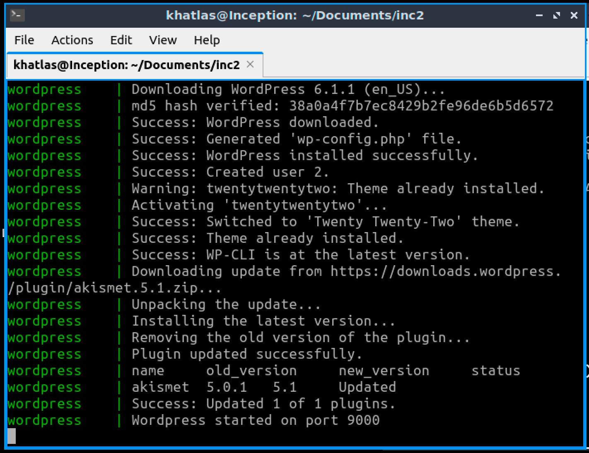

<!-- Improved compatibility of back to top link: See: https://github.com/othneildrew/Best-README-Template/pull/73 -->

<!-- PROJECT LOGO -->
 

  

  <h3 align="center">42 Inception</h3>

<!-- TABLE OF CONTENTS -->

  
Table of Contents

  <ol>
    <li>
      <a href="#about-the-project">About The Project</a>
      <ul>
        <li><a href="#built-with">Built With</a></li>
      </ul>
    </li>
    <li>
      <a href="#getting-started">Getting Started</a>
      <ul>
        <li><a href="#prerequisites">Prerequisites</a></li>
      </ul>
    </li>
    <li><a href="#usage">Usage</a></li>
    <li><a href="#license">License</a></li>
    <li><a href="#contact">Contact</a></li>
  </ol>

<!-- ABOUT THE PROJECT -->
## About The Project
<h2>
  
</h2>
This project is about learning to use Docker and docker-compose.
We are tasked with creating an NGINX, Wordpress, MariaDB stack without using the original docker images, and instead using the latest version of either Alpine or Debian.

Here was my approach:
* Look at the original Docker images and see how they manage their configurations and what daemons they run
  * https://www.nginx.com/blog/deploying-nginx-nginx-plus-docker/
  * https://github.com/MariaDB/mariadb-docker
  * https://github.com/docker-library/wordpress
* Create an NGINX container that serves only a static index.html page, using port 80
  * https://www.docker.com/blog/how-to-use-the-official-nginx-docker-image/
* Wordpress and MariaDB could only work when done together, so invest time into researching how they will interface together, this applies between NGINX and Wordpress aswell (While I don't have my resources ready now, I can explain a little how they interface later in the README file)
* Initialise MariaDB, research into SQL syntax and how to create databases
* Coordinate everything into a docker-compose file
* Investigate into how docker networks work and create your network
* Look into bind volumes
* Put some time into creating scripts that will automate a few things for me in the local environment, among which:
  * creating an .env file
  * creating a ssl key and certificate
  * creating a log directory and log files (for mariadb and nginx, wordpress is vocal enough)
  * creating volume folders
  * adding domain to hosts file
* Utilise keys in ssl connection, only use port 443 in NGINX container from now on
* Make hundreds of small tweaks and changes and eventually end up with a working product (to be continued)

(<a href="#readme-top">back to top</a>)

### Built With

This section should list any major frameworks/libraries used to bootstrap your project. Leave any add-ons/plugins for the acknowledgements section. Here are a few examples.

* Docker
* docker-compose
* Make
* bash
* NGINX
* Wordpress
* MariaDB

(<a href="#readme-top">back to top</a>)

<!-- GETTING STARTED -->
## Getting Started

To run my program, use make in the root folder, this should create all dependencies

### Prerequisites

Prior to running please install the following:
* Docker
* docker-compose
* Make

Add yourself to the docker group

## Usage

Use make without sudo, otherwise the result will not be successful
Upon receiving message "Wordpress has been started on port 9000" you may open your browser and type "https://khatlas.42.fr" and be redirected to "https://khatlas.42.fr/wordpress"
Data will be retained in ~/data, if you already have a folder named wordpress or mariadb over there it will be treated as the volume and results may vary
In order to remove retained data volumes run make fclean, a prompt will ask you if you would like to remove ~/data, do not type your password if you are using ~/data for anything and instead manually type: "sudo rm -rf ~/data/wordpress && rm -rf ~/data/mysql"
Re-running after removing volumes will create a new volume
Logging in to wp-admin looks as follows: go to url: https://khatlas.42.fr/wordpress/wp-admin and type your username and password. These will have been randomly generated and can be found in ./srcs/.env The passwords are composed of random alphanumeric characters every time you remove the .env file and re-run the Makefile

## What more did I want to implement

Creating a private ssl key and certificate locally and copying it is not secure, and I wanted to create a swarm cluster in which I could transfer secret encrypted files, I still want to do this but docker swarm is a bit of a rabbit hole
In 42 we are unable to add a domain to the hosts file (for good reasons) and I wanted to see if I can make the website work if I port forward it to the local Mac environment
I also wanted to do the bonus, though I was afraid that I would run into too many roadblocks, and time is precious

<!-- LICENSE -->
## License

Distributed under the MIT License. See `LICENSE.txt` for more information.

(<a href="#readme-top">back to top</a>)

<!-- CONTACT -->
## Contact

Kewin Hatlas  - kewin.hatlas@gmail.com

Project Link: [https://github.com/atticbat/inception](https://github.com/atticbat/inception)

(<a href="#readme-top">back to top</a>)

(<a href="#readme-top">back to top</a>)

<!-- MARKDOWN LINKS & IMAGES -->
<!-- https://www.markdownguide.org/basic-syntax/#reference-style-links -->
[contributors-shield]: https://img.shields.io/github/contributors/othneildrew/Best-README-Template.svg?style=for-the-badge
[contributors-url]: https://github.com/othneildrew/Best-README-Template/graphs/contributors
[forks-shield]: https://img.shields.io/github/forks/othneildrew/Best-README-Template.svg?style=for-the-badge
[forks-url]: https://github.com/othneildrew/Best-README-Template/network/members
[stars-shield]: https://img.shields.io/github/stars/othneildrew/Best-README-Template.svg?style=for-the-badge
[stars-url]: https://github.com/othneildrew/Best-README-Template/stargazers
[issues-shield]: https://img.shields.io/github/issues/othneildrew/Best-README-Template.svg?style=for-the-badge
[issues-url]: https://github.com/othneildrew/Best-README-Template/issues
[license-shield]: https://img.shields.io/github/license/othneildrew/Best-README-Template.svg?style=for-the-badge
[license-url]: https://github.com/othneildrew/Best-README-Template/blob/master/LICENSE.txt
[linkedin-shield]: https://img.shields.io/badge/-LinkedIn-black.svg?style=for-the-badge&logo=linkedin&colorB=555
[linkedin-url]: https://linkedin.com/in/othneildrew
[product-screenshot]: images/screenshot.png
[Next.js]: https://img.shields.io/badge/next.js-000000?style=for-the-badge&logo=nextdotjs&logoColor=white
[Next-url]: https://nextjs.org/
[React.js]: https://img.shields.io/badge/React-20232A?style=for-the-badge&logo=react&logoColor=61DAFB
[React-url]: https://reactjs.org/
[Vue.js]: https://img.shields.io/badge/Vue.js-35495E?style=for-the-badge&logo=vuedotjs&logoColor=4FC08D
[Vue-url]: https://vuejs.org/
[Angular.io]: https://img.shields.io/badge/Angular-DD0031?style=for-the-badge&logo=angular&logoColor=white
[Angular-url]: https://angular.io/
[Svelte.dev]: https://img.shields.io/badge/Svelte-4A4A55?style=for-the-badge&logo=svelte&logoColor=FF3E00
[Svelte-url]: https://svelte.dev/
[Laravel.com]: https://img.shields.io/badge/Laravel-FF2D20?style=for-the-badge&logo=laravel&logoColor=white
[Laravel-url]: https://laravel.com
[Bootstrap.com]: https://img.shields.io/badge/Bootstrap-563D7C?style=for-the-badge&logo=bootstrap&logoColor=white
[Bootstrap-url]: https://getbootstrap.com
[JQuery.com]: https://img.shields.io/badge/jQuery-0769AD?style=for-the-badge&logo=jquery&logoColor=white
[JQuery-url]: https://jquery.com 
